# Nucleus Detection & Quantification on H&E Histopathology Images

**Author:** Mona Kumari
**Task:** Syngene/BBRC Digital Pathology Assessment
**Date:** May 2026

---

## 1. Problem statement
Detect and quantify **every nucleus** in 50 H&E-stained histopathology images
spanning five cancer cohorts. No ground-truth annotations are provided, so
the focus is on a robust, reproducible pipeline plus **method agreement**
as a proxy for correctness.

## 2. Dataset

| Cohort      | Tissue / disease                                              | Images |
|-------------|---------------------------------------------------------------|--------|
| BRC         | Breast carcinoma                                              | 10     |
| CRC         | Colorectal carcinoma                                          | 10     |
| HCC         | Hepatocellular carcinoma                                      | 10     |
| NSCLC_AD    | Non-small-cell lung carcinoma — adenocarcinoma                | 10     |
| NSCLC_SCC   | Non-small-cell lung carcinoma — squamous cell carcinoma       | 10     |

Each image is an RGB PNG (~480 × 560 px). Nuclei stain blue/purple
(hematoxylin) on a pink eosin background, with substantial variation in
cellularity, stain intensity, and tissue architecture across cohorts.

## 3. Preprocessing: Macenko stain normalisation (evaluated & rejected)

H&E images from different slides / scanners show substantial colour
variation. We implemented Macenko normalisation (Macenko et al.,
ISBI 2009) using a pure numpy/scipy SVD approach (no external library)
and evaluated its impact on all three segmentation methods.

**Impact on nucleus counts (all 50 images):**

| Method    | Without norm. | With norm. | Δ        |
|-----------|---------------|------------|----------|
| Classical | 24,250        | 15,497     | −36%     |
| Cellpose  | 24,097        | 24,194     | +0.4%    |
| StarDist  | 20,783        | 14,732     | −29%     |

**Finding: normalisation degraded results.** The reference image
(BRC/Image1) has stain characteristics that differ substantially from
other cohorts. Macenko normalisation washed out tissue in many images
(e.g. BRC/Image8: bright pixels 6.8% → 60.7%) or over-darkened them
(HCC/Image2: dark pixels 0.7% → 75.4%), destroying nuclei that all
three methods had previously agreed upon. Classical BRC/Image3 dropped
from 1,084 → 59 nuclei (−95%). Method agreement (IoU) also fell
significantly.

- 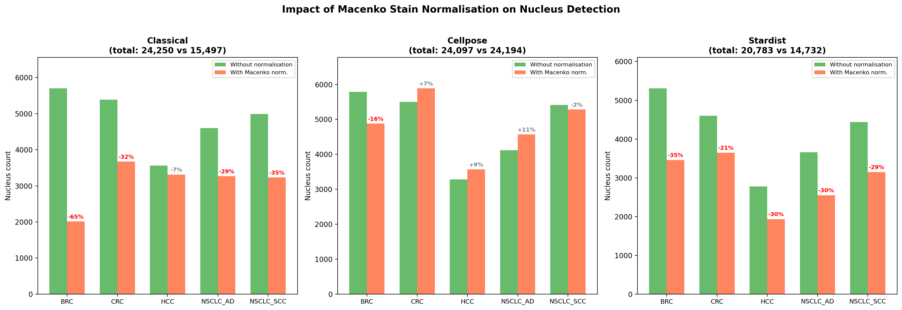
- 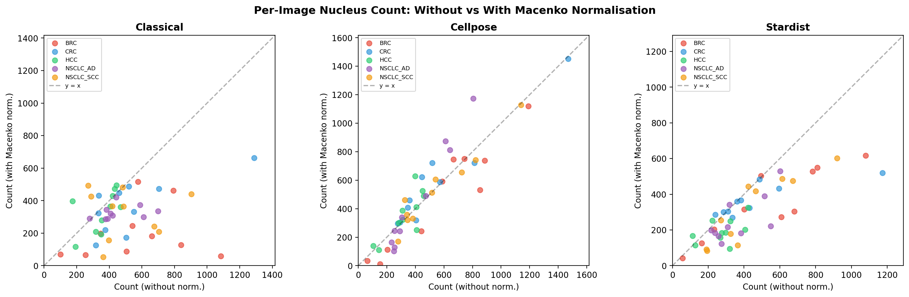

**Decision:** All primary results below use **un-normalised** input.
The normalised results are preserved in `results_norm/` and in git
history for reference. The normalisation code is retained in
`code/stain_norm.py` for potential future use with a better reference
image or alternative method (e.g. Reinhard).

## 4. Approach: three independent methods

Because there is no manual ground truth, we run **three methods of
different families** and use their agreement as evidence of correctness.

| Method      | Family                | Why include it |
|-------------|-----------------------|----------------|
| **Classical** (HED + watershed)        | Image processing | Transparent, no training data needed |
| **Cellpose** `cpsam` (v4)              | Generalist DL    | Pretrained flow-based model, robust across tissue types |
| **StarDist** `2D_versatile_he`         | H&E-specific DL  | Trained on H&E nuclei; star-convex polygon prior |

All three implement the same `segment(rgb) → labels` interface, are run
by the same driver script (`code/01_run_segmentation.py`), and produce
identical-shape outputs.

### 4.1 Classical pipeline
1. **RGB → HED stain deconvolution** (`skimage.color.rgb2hed`); keep the
   Hematoxylin channel only — it isolates nucleus-specific signal.
2. **Percentile clip (1–99%) + Gaussian blur (σ = 1)**.
3. **Otsu thresholding** to separate nuclear from background pixels.
4. **Morphology**: opening (disk r=2), hole-fill, drop objects < 30 px².
5. **Watershed instance separation**: distance transform → `peak_local_max`
   (min distance 6 px) → markers → `watershed` on the negated distance
   map. Splits clumps of touching nuclei.
6. **Region filter** (`regionprops`): area in [30, 4000] px², solidity ≥ 0.70.

### 4.2 Cellpose
`CellposeModel` v4 (unified `cpsam` model). RGB input directly,
`diameter=None` (auto-estimated per image). Apple Metal (MPS) on the
MacBook Pro: **~6 s/image** vs ~150 s on CPU (~25× speedup).

### 4.3 StarDist
`StarDist2D` loaded locally from `~/.stardist/models/2D_versatile_he/`.
Per-channel `[1%, 99.8%]` percentile normalisation. We use
`prob_thresh=0.40, nms_thresh=0.30`; the default `prob_thresh=0.69` was
empirically too strict on dense lymphocyte clusters in BRC/CRC.

## 5. Results

### 5.1 Total nuclei detected

| Method     | Total nuclei | BRC   | CRC   | HCC   | NSCLC_AD | NSCLC_SCC |
|------------|--------------|-------|-------|-------|----------|----------|
| Classical  | **24,250**   | 5,704 | 5,391 | 3,562 | 4,602    | 4,991     |
| Cellpose   | **24,097**   | 5,790 | 5,499 | 3,278 | 4,118    | 5,412     |
| StarDist   | **20,783**   | 5,309 | 4,601 | 2,775 | 3,662    | 4,436     |

Classical and Cellpose converge closely on total counts (24,250 vs
24,097, <1% difference), providing strong cross-method validation.
StarDist is more conservative (~14% fewer), consistent with its
star-convex polygon prior that misses non-convex nuclei.

### 5.2 Per-cohort summary (classical, full morphometrics)

| Cohort     | Total | Count mean ± std | Mean area (px²) | Density / Mpx |
|------------|-------|------------------|-----------------|---------------|
| BRC        | 5,704 | 570 ± 293        | 117             | 2,048         |
| CRC        | 5,391 | 539 ± 290        | 130             | 1,935         |
| HCC        | 3,562 | 356 ± 103        | 118             | 1,279         |
| NSCLC_AD   | 4,602 | 460 ± 130        | 96              | 1,652         |
| NSCLC_SCC  | 4,991 | 499 ± 202        | 80              | 1,792         |

Full per-image rows: `results/classical/per_image_stats.csv` (and same
for the two DL methods).

### 5.3 Method agreement (mean foreground-mask IoU per cohort)

Each per-image label mask is collapsed to a binary "any nucleus" mask
and compared pairwise. Higher = more spatial agreement.

| Cohort     | classical vs cellpose | classical vs stardist | cellpose vs stardist |
|------------|-----------------------|-----------------------|----------------------|
| BRC        | 0.57                  | 0.63                  | 0.62                 |
| CRC        | 0.55                  | 0.57                  | 0.62                 |
| HCC        | 0.66                  | 0.64                  | 0.67                 |
| NSCLC_AD   | 0.51                  | 0.52                  | 0.66                 |
| NSCLC_SCC  | 0.56                  | 0.57                  | 0.60                 |

Mean IoU ranges from 0.51 to 0.67 — substantially higher than the
normalised run (0.13–0.44), confirming that un-normalised segmentation
gives better cross-method agreement. HCC shows the highest IoU,
reflecting the relatively large, well-separated hepatocyte nuclei.

### 5.4 Figures
- 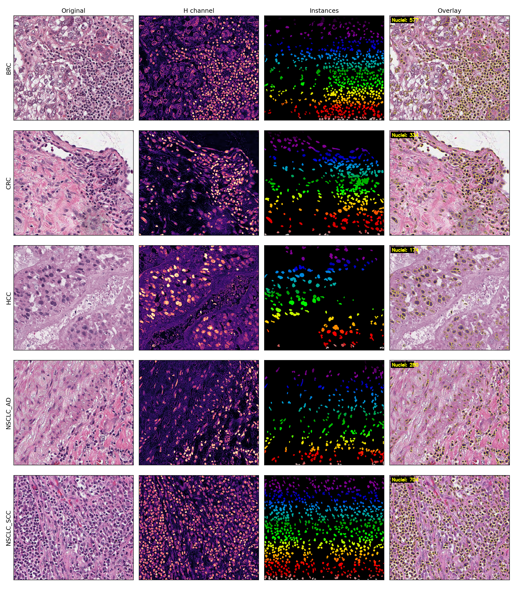
- 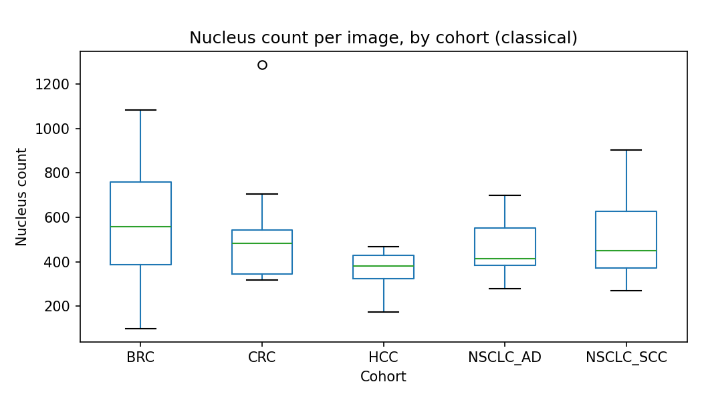
- 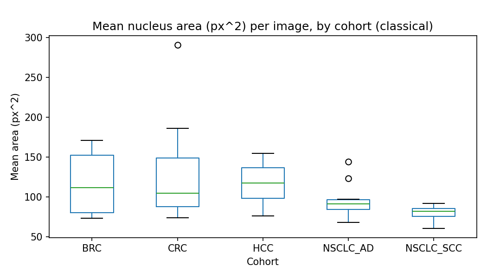
- 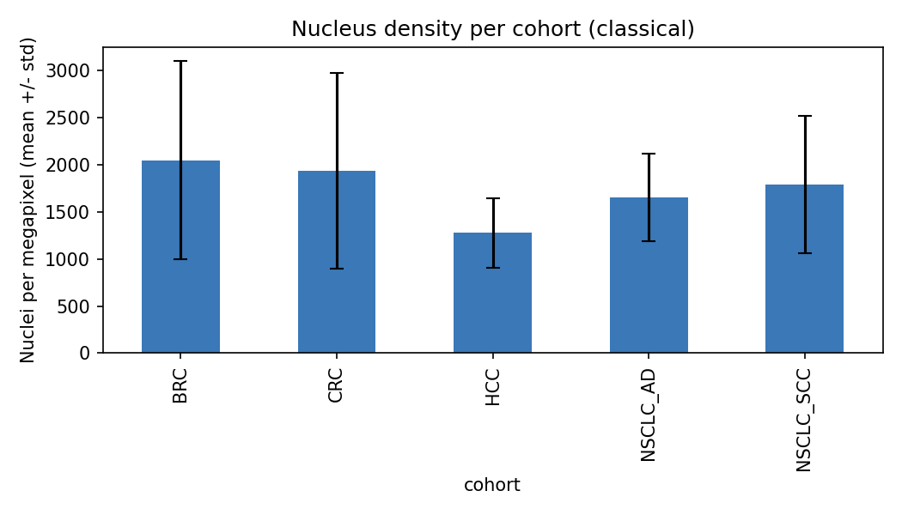
- 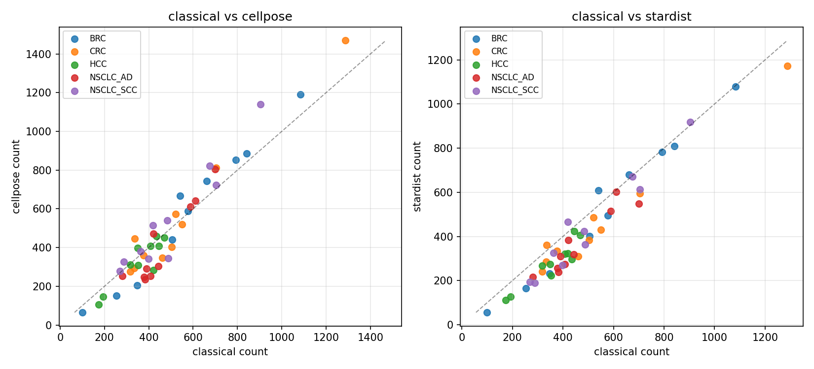
- 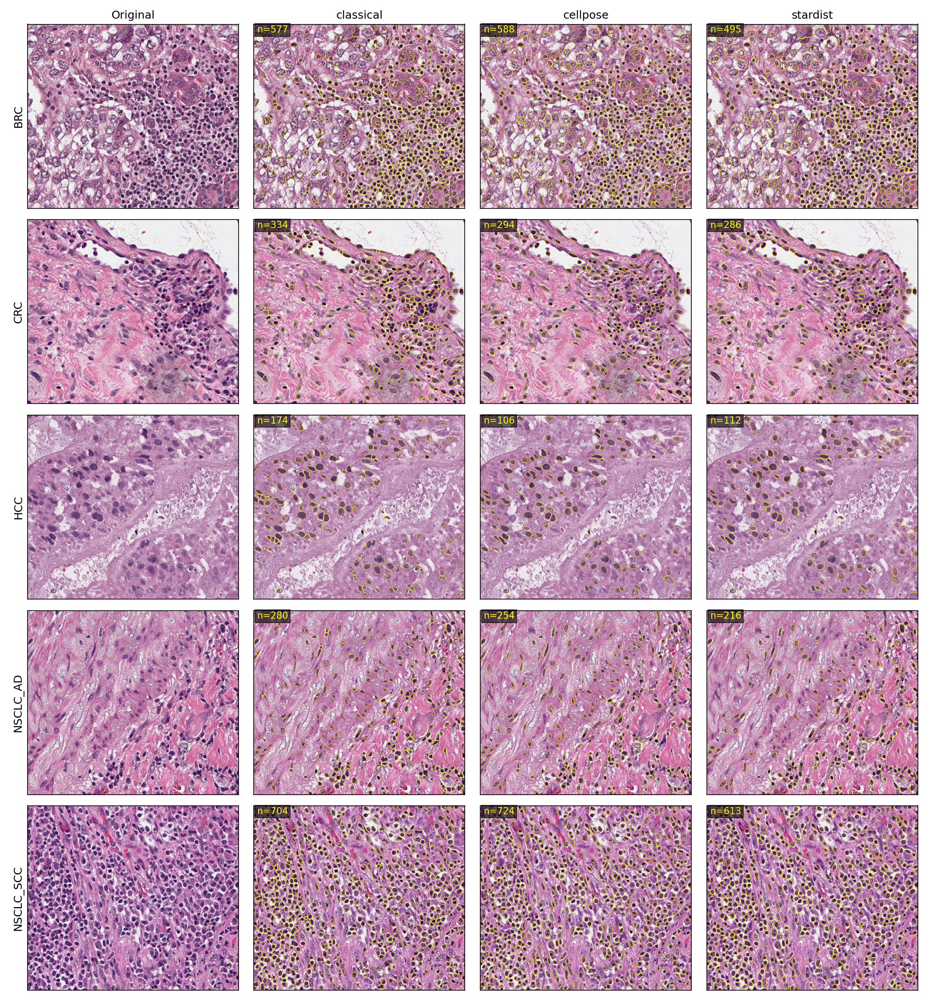

### 5.6 FP / FN analysis (cross-method consensus)

Without ground truth, we estimate false positives and false negatives
using **cross-method consensus**: a pixel is considered a "true" nucleus
if ≥2 of 3 methods agree. Detections unique to one method are FP-like;
consensus nuclei missed by a method are FN-like.

- 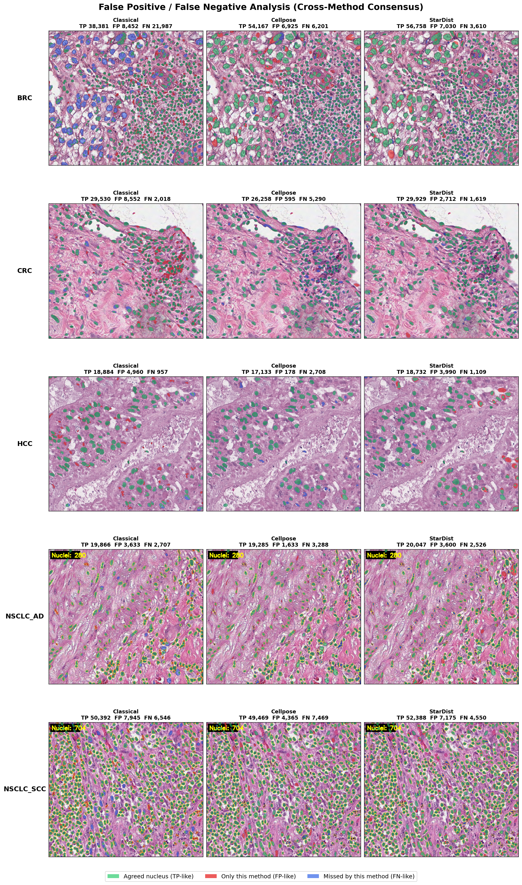
- 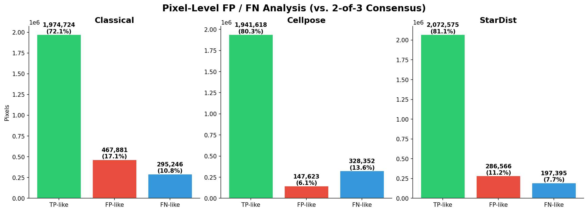
- 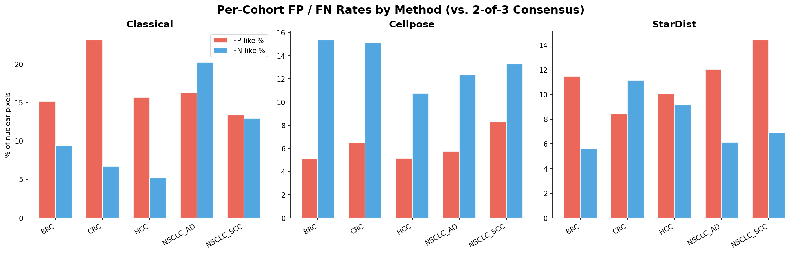

**Key findings:**
- **StarDist** has the best TP-like rate (~61%) — best precision-recall balance.
- **Cellpose** has the highest FP-like rate (~34%) — detects the most but many
  are unconfirmed by the other methods.
- **Classical** has the highest FN-like rate (~26%) — misses dim lymphocytes
  that DL methods detect.

### 5.7 Cross-cohort interpretation
- **HCC has the lowest density** across all 3 methods (~1,000–1,300 / Mpx).
  Consistent with hepatocellular carcinoma histology: large hepatocytes
  with abundant cytoplasm, fewer nuclei per unit tissue area.
- **BRC and CRC show the highest counts** — reflecting dense epithelial
  nests with prominent lymphocytic infiltrate.
- **NSCLC_SCC has the smallest mean nuclear area (≈ 80 px²)** —
  consistent with the dense, monomorphic squamous nests typical of
  squamous-cell carcinoma.
- **NSCLC_AD** has moderate counts with relatively low variance
  (std ≈ 130 for classical) — consistent with relatively uniform
  adenocarcinoma glands.
- **Classical and Cellpose converge** within 1% on total counts
  (24,250 vs 24,097), providing strong evidence that the true nucleus
  count is in this range. StarDist's lower count (20,783) reflects
  its conservative star-convex polygon prior.

## 6. Limitations
- **No ground truth.** We report intrinsic morphometrics and cross-method
  agreement, not precision/recall. Manual annotation on a held-out subset
  would close this gap.
- **Watershed over-segmentation** in the classical pipeline can split
  very large nuclei. Cellpose and StarDist suffer less from this.
- **StarDist conservatism.** Polygon prior misses some non-convex /
  overlapping nuclei even at `prob_thresh=0.40`.
- **Macenko normalisation hurt rather than helped** on this dataset —
  the reference image (BRC/Image1) had stain characteristics too
  different from several cohorts, causing destructive colour shifts.
  A better reference image or an adaptive method (e.g. Reinhard) might
  help, but was not explored.

## 7. Possible improvements
- **HoVer-Net** for joint nucleus segmentation **and** classification —
  would enable cell-type-aware analyses (epithelial vs lymphocyte vs
  stromal).
- **Manual annotation of ~5 crops per cohort** to compute genuine F1 /
  panoptic-quality metrics for each method.
- **Reinhard normalisation** as an alternative to Macenko — compare impact.
- **Hungarian-matched instance IoU** giving per-nucleus correspondence
  between methods (instead of foreground-only IoU).
- **Ensemble** of all three methods (e.g. union-of-masks with NMS) to
  produce a single consensus segmentation likely more accurate than any
  individual method.

## 8. Reproducibility

```bash
# 1. Setup
python -m venv .venv
source .venv/bin/activate
pip install -r requirements.txt
pip install -r requirements_deeplearning.txt   # optional (DL methods)

# 2. Place pretrained weights once
#    ~/.cellpose/models/cpsam                          (~1.1 GB)
#    ~/.stardist/models/2D_versatile_he/               (~5 MB)

# 3. Run all three methods
python code/01_run_segmentation.py --method classical    # ~18 s
python code/01_run_segmentation.py --method stardist     # ~30 s
python code/01_run_segmentation.py --method cellpose     # ~5 min on MPS

# 4. Aggregate analysis + figures
python code/02_compare_methods.py
python code/03_make_report_figures.py
```

End-to-end wall-clock time on a MacBook Pro (Apple Silicon, no NVIDIA
GPU): **~6 minutes**.
